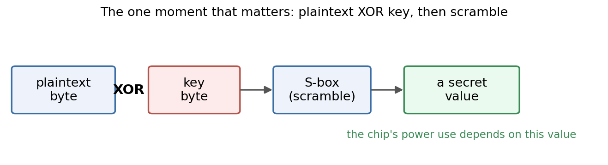
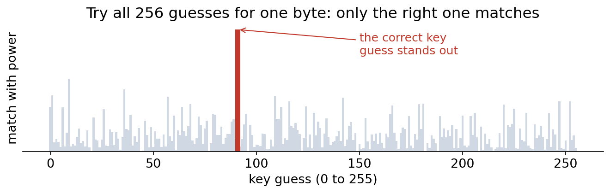
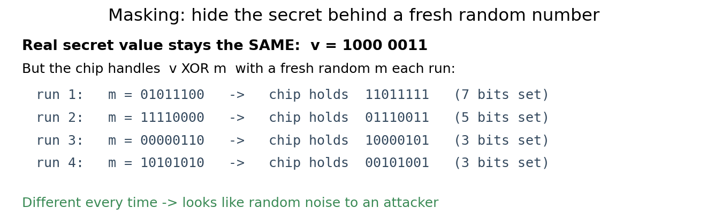
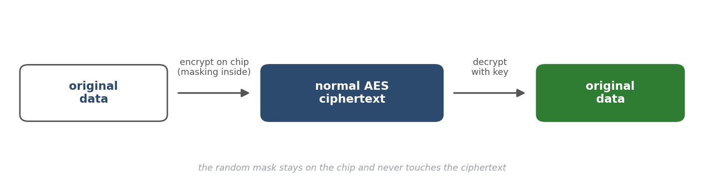
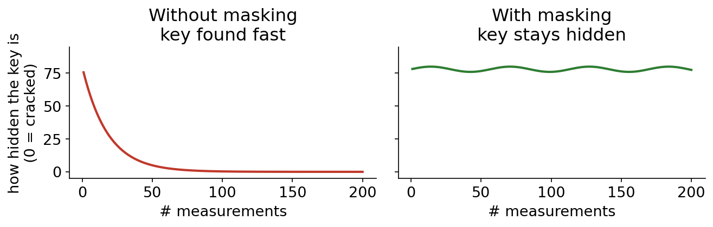

# How a secret key leaks from a chip, and one simple way to stop it

Recover a secret AES-128 key from a chip's **power consumption** with no access to the key
itself, then block that same attack with a small countermeasure called masking. A hands-on
project in AI, embedded systems, and hardware security, done end to end on a real board.

> Status: done and verified on a ChipWhisperer-Nano. The key falls to a classic attack (CPA) in
> about 100 measurements and to a small neural network in about 12. With masking turned on,
> neither attack recovers the key in 5000 measurements, and the data still decrypts back to the
> exact original.

📄 **Read the short illustrated primer (PDF):** [`docs/primer/simple-attack-and-defense.pdf`](docs/primer/simple-attack-and-defense.pdf)
🎓 **Want the longer, step-by-step guide?** [`docs/LEARNING.md`](docs/LEARNING.md) (plain language, no background needed)

---

## The idea in one line

When a chip encrypts something, the amount of power it draws shifts depending on the data it is
working on. Watch that power closely and you can work backwards to the secret key, without ever
breaking the math.

## The one moment that matters

AES does many steps. The attack only cares about one. Early on, the chip takes a byte of your
message, mixes it with a byte of the secret key, and runs the result through a fixed scramble
table (the S-box). Out comes a value, and the chip's power at that instant depends on it.



Recover that value from the power and you have recovered the key byte that made it.

## The attack

We do not know the key, so we try all 256 possible values for one byte. For each guess we
predict what the power should look like, then check which guess matches the real power. Only the
right one fits, and it stands out above the rest. Repeat for all 16 bytes and the whole key
falls out.



On the real board this pulled out the entire key from about 100 measurements with the classic
method (CPA), and from about 12 with a small neural network.

## The fix: masking

The attack works because that secret value sits in the chip the same way every time. Masking
takes that away. Before the chip touches the value, it hides it behind a fresh random number, a
new one for every encryption, so the leaking value looks like noise.



The real secret is the same each run, but the number the chip actually handles changes every
time because of the random mask. To anyone watching the power, it is just noise.

## Getting your data back

If the chip scrambled everything with a random number, how does anyone read the message back?
The mask never leaves the chip. It goes on while the chip works, then comes off right before the
ciphertext goes out, because XOR-ing the same byte twice returns the original. So the ciphertext
that leaves is a completely normal AES ciphertext, and decryption is just plain AES with the
key. The masks are private and disposable: each chip rolls its own to hide its own leakage, then
throws them away. Only the key is shared.



## Did it work?

Yes, on both counts. With masking on, the same two attacks ran again on the same chip and
neither could find the key, even after 5000 measurements. And the data still came back clean:
the masked chip's output decrypts to the exact original message, confirmed in software across
thousands of cases and live on the board (16 out of 16 fresh encryptions decrypted right back).



| | Masked chip | Unprotected (baseline) |
|---|---|---|
| Original data recovered after decrypt | yes | yes |
| Key recovered by an attacker | no (fails at 5000) | yes (CPA ~100, CNN ~12) |

---

## How to run and test it

👉 **Step-by-step runbook with every command and what to expect:** [`docs/RUN_STEPS.md`](docs/RUN_STEPS.md)

**You need:** macOS or Linux, Python 3.9 to 3.11, and a C compiler (`cc`, `clang`, or `gcc`)
for the masked-firmware host tests. A ChipWhisperer-Nano is only needed if you want to capture
fresh power traces (see the note below).

**Set up:**
```bash
python3 -m venv .venv && source .venv/bin/activate
pip install -r requirements.txt && pip install -e . --no-deps
```

**Run the full test suite:**
```bash
pytest -q
```
This checks the attack math, the masked AES, and the safety results. The masked-AES correctness
tests compile the C and run with no hardware. Tests that need the captured power traces (large
`.npz` files, not stored in git, see below) skip themselves automatically if the files are not
present.

**See the headline verdict (data safe and recoverable):**
```bash
python scripts/us3_verdict.py        # writes results/masking_verdict.json -> PASS
```

**Reproduce the attack and the defense** (needs the saved power traces, or capture your own):
```bash
# attack on the unprotected target
#   notebooks/02_cpa_baseline.ipynb   (Run All) -> recovers the key, ~100 traces (CPA)
#   notebooks/03_cnn_dlsca.ipynb      (Run All) -> recovers the key, ~12 traces (CNN)

# defense on the masked target
python scripts/us3_attack_masked.py   # CPA + CNN on masked traces -> neither recovers
python scripts/us3_figure.py          # builds results/us3_defense_ge.png
```
Step-by-step commands for the masked capture, attack, and figure are in
[`scripts/README.md`](scripts/README.md).

**A note on the power traces:** the captured `.npz` trace files are large (about 100 MB each)
and are not committed to git. The host tests and the masked-AES checks run without them. To get
the trace-dependent steps, capture your own on a ChipWhisperer-Nano. Every step that flashes
firmware, claims the USB device, or drives the board is done with explicit human approval and is
logged in [`notes/approvals.md`](notes/approvals.md).

## What is in the repo

```
docs/primer/   the short illustrated PDF and its figures
docs/          LEARNING.md (the long guide) and a full attack walkthrough
src/dlsca/     the analysis code: leakage model, CPA, the CNN, key ranking, AES reference
firmware/      the unprotected AES and our own Cortex-M0 masked AES (with a host test)
scripts/       reproduce the masked capture, attacks, and figures
tests/         host tests (run with pytest, no hardware)
results/       the JSON results and the figures
content/       the writeups (the attack and the defense)
notes/         the lab record, including the hardware-approval log
```

## Hardware

ChipWhisperer-Nano (the capture board with an onboard STM32F0 / Cortex-M0 target). A MacBook
trains the neural network on its GPU. The masking countermeasure is our own AES written in C for
the Cortex-M0, because the kit's masked AES targets larger chips (Cortex-M4 or AVR).

## References

- ChipWhisperer SCA101 and SCA201 tutorials (ship with the kit)
- Deep-learning side-channel analysis literature

## License

MIT. See [`LICENSE`](LICENSE).
