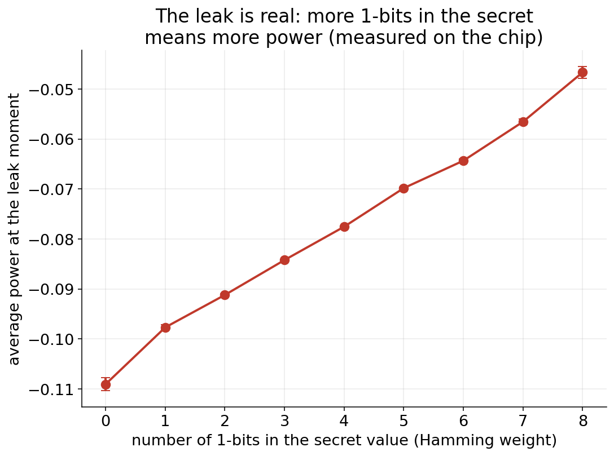
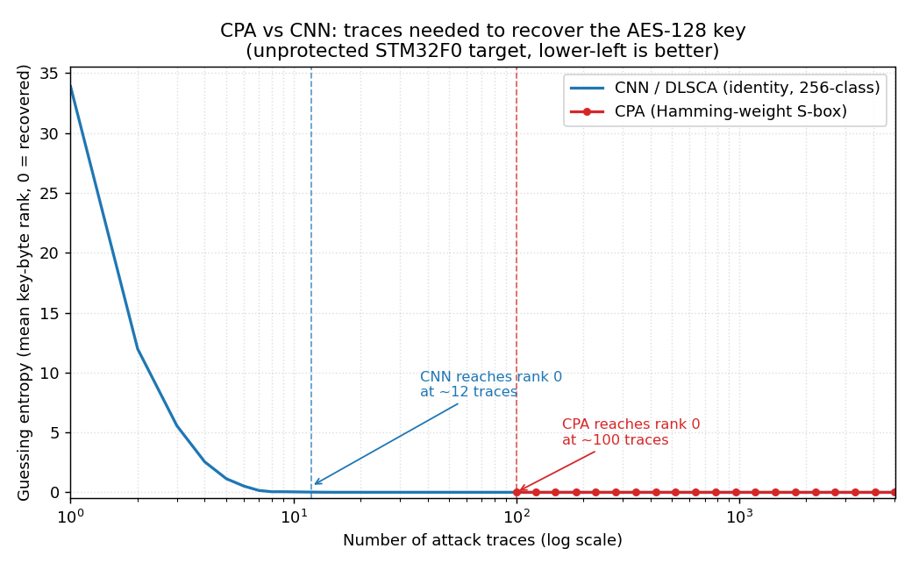
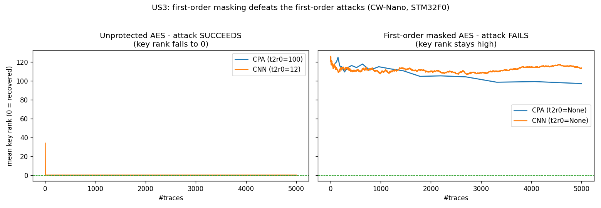

# How a secret key leaks from a chip, and one simple way to stop it

**Vivek Tiwari** · [linkedin.com/in/vhtiwari](https://www.linkedin.com/in/vhtiwari) · June 2026

This document shows how a secret AES key can be recovered from a chip by measuring its power,
and how a countermeasure called masking blocks that attack. The results were measured on a
ChipWhisperer-Nano board.

## The idea in one line

When a chip encrypts something, the amount of power it draws shifts depending on the data it is
working on. Watch that power closely and you can work backwards to the secret key. You never
have to break the math.

## The one moment that matters

AES does a lot of steps. The attack only cares about one of them. Early on, the chip takes a
byte of your message, mixes it with a byte of the secret key, and pushes the result through a
fixed scramble table called the S-box. Out comes a value, and the chip's power at that instant
depends on it.

That is the whole foothold. Recover that value from the power and you have recovered the key
byte that made it.

## A tiny example

Say one key byte is `0x2B` and the matching message byte is `0x6A`.

- Mix them: `0x6A XOR 0x2B = 0x41`.
- Scramble: the S-box turns `0x41` into `0x83`, which is `1000 0011` in bits.
- That value has three 1s, and the chip burns slightly more power when there are more 1s.

We do not know the key, so we just try all 256 possible values for that one byte. For each guess
we predict what the power should look like, then see which guess matches the real power. Only the
right one fits. Do that for all 16 key bytes and the whole key falls out.

## The hack

In practice this is statistics over a pile of measurements. The correct guess produces a
prediction that moves with the measured power. The other 255 guesses look like noise. Plot them
all and the right key byte pokes up above the rest.

On a real board, this pulled out the entire key from about 100 measurements. A
neural-network version of the same trick did it in roughly 12.

## The fix: masking

The attack works because that secret value sits in the chip the same way every time, in plain
view of anyone watching the power. Masking takes that away. Before the chip ever touches the
value, it hides it behind a fresh random number, a new one for every single encryption.

Look at what changes. The real secret is identical each run, but the number the chip actually
handles is different every time because of the random mask. To someone watching the power, it is
just noise. And here is the neat part: the random number cancels itself out at the end, so the
encryption still spits out the correct answer. You get the protection for free.

## Getting your data back

If the chip scrambled everything with a random number, how does anyone read the original message
back?

The mask never leaves the chip. The chip puts the mask on while it works, then takes it off again
right before the ciphertext goes out the door. That works because XOR-ing the same byte twice
brings you back to where you started. Hide `0x83` with the mask `0x5C` and you get `0xDF`. XOR that
same `0x5C` back in and you are back to `0x83`. So the ciphertext that actually leaves the chip is
a completely normal AES ciphertext, exactly as if masking had never been used.

That means decryption is just plain AES decryption with the key. You do not need the mask, and you
do not even need to know masking was switched on. The key alone gets the original data back.

The masks are private and disposable. The only thing the two sides share is the key. Each chip
rolls its own random masks to hide its own power leakage, then throws them away. They are never
stored and never sent anywhere. This is not like a one-time pad, where both ends have to share a
matching list of random bytes.

There is one fiddly step. The S-box is a nonlinear lookup, so the chip cannot just hand it a masked
byte and peel the mask off afterward with the normal table. Instead it builds a small masked copy of
the lookup table for that one step, so once the mask comes off the value lines up with the regular
S-box result.

## Did it work?

It did. With masking switched on, the same two attacks ran again on the same chip. Neither could
find the key, even after 5000 measurements, far past what it took to crack the unprotected chip.

We also checked the other half: that the data still comes back out clean. The masked chip's output
decrypts to the exact original message every time. We confirmed it in software across thousands of
cases, and live on the real board, where 16 out of 16 fresh encryptions decrypted right back to
their starting plaintext. So the data is both protected and fully recoverable.

## The real measurements behind this

Everything above is the simple version. Here is the actual data from the board.

The leak, measured. At the moment the chip handles the secret value, the more 1-bits that value
has, the more power the chip draws. This straight line is the leak the attack relies on.

Recovering the key. This is how the key rank falls to zero as we feed in more measurements. The
classic attack gets there in about 100, the small neural network in about 12.

With masking on. The same two attacks now flatten out and never reach the key, even after 5000
measurements.

## The honest bottom line

A running chip quietly leaks hints about its secrets through its power, and that is enough to
lift an encryption key with surprisingly little work. Masking shuts that down by randomizing the
data the chip handles, and it stopped both attacks here. One caveat worth saying out loud: this
covers the simple, single-point attacks shown above. A determined attacker can push further,
which is why real devices stack several defenses on top of each other. As a first line, though,
masking turns an easy break into a hard one.
